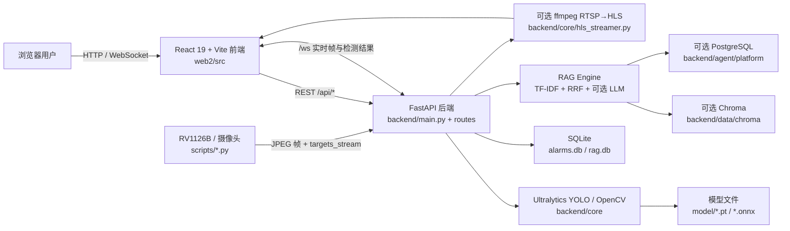

# PCB 缺陷检测系统：项目结构总览

> 盘点时间：2026-07-13 09:15:35 +08:00  
> 证据范围：工作区实际源码、配置文件、依赖声明及锁文件；不扫描 `.git`、`.venv`、`.npm-cache`、`node_modules`、缓存和构建产物。

## 1. 项目概览

本项目是面向 PCB 六类缺陷的检测与知识问答系统。浏览器端提供图片检测、板端实时检测、历史记录、配置和 RAG 页面；FastAPI 后端负责 YOLO 推理、WebSocket 数据转发、告警落库、RAG 检索及可选 HLS 转换；`scripts/` 提供 RV1126B/摄像头侧采集与推流；模型与运行数据保存在本地目录。

## 2. 总体架构



主链路：`start.py` 启动 `backend/main.py`（5000）和 Vite（5173）；Vite 将 `/api`、`/ws`、`/hls`、`/video_output` 代理给后端。板端脚本通过 WebSocket 上传画面和推理结果，后端广播给前端。

## 3. 目录结构

```text
test4/
├─ backend/                 FastAPI 后端
│  ├─ main.py               应用入口、生命周期、WebSocket、健康/调试接口
│  ├─ routes/               detect、rag、hls REST 路由
│  ├─ core/                 YOLO、视频源、推理管线、硬件遥测、HLS
│  ├─ agent/                RAG、记忆、Chroma/PostgreSQL 适配
│  ├─ services/             LLM 与 embedding 调用
│  ├─ store/                SQLite 告警与历史存储
│  ├─ utils/                透视变换、环形缓冲
│  └─ data/                 配置、SQLite、Chroma 运行数据
├─ web2/                    React/Vite 前端及可选 Express 服务
│  ├─ src/components/       页面与布局组件
│  ├─ src/utils/            WebSocket 客户端、数据适配
│  ├─ src/App.tsx           前端状态与消息编排
│  ├─ server.ts             独立 Express/WS 模拟或代理服务
│  └─ package*.json         npm 声明与锁文件
├─ scripts/                 板端摄像头、framebuffer 与 WS 推流脚本
├─ model/                   PyTorch/ONNX 模型资产
├─ image/                   示例 PCB 图片
├─ example/                 外部平台连接示例
├─ data/                    根目录 Chroma 运行数据
├─ start.py                 前后端一键启动入口
├─ pyproject.toml           Python 项目与依赖声明
├─ requirements.txt         pip 依赖声明（与 pyproject 基本重复）
└─ uv.lock                  uv 锁文件（当前仅含项目自身，未锁第三方包）
```

`.venv`、`.npm-cache`、`.vite`、`__pycache__` 和运行数据库属于环境/缓存/运行产物，不计入源码架构。

## 4. 技术栈与证据

| 层次 | 语言/技术 | 职责 | 证据文件 |
|---|---|---|---|
| 前端 | TypeScript、React 19、Vite 6、Tailwind CSS 4 | 单页 UI、检测结果展示、配置与 RAG 交互 | `web2/package.json`、`web2/src/main.tsx`、`web2/src/App.tsx`、`web2/vite.config.ts` |
| 前端通信 | Fetch、原生 WebSocket、HLS.js | REST、实时帧/遥测、可选 HLS 播放 | `web2/src/utils/wsClient.ts`、`web2/src/components/*.tsx`、`web2/package.json` |
| 可选 Node 服务 | Express 4、ws 8、tsx | 独立 Web/WS 服务及 Gemini 接口 | `web2/server.ts`、`web2/package.json` |
| 后端 | Python 3.11、FastAPI、Uvicorn、Pydantic | API、WebSocket、配置及生命周期 | `.python-version`、`backend/main.py`、`backend/models.py`、`pyproject.toml` |
| 视觉推理 | Ultralytics、OpenCV、NumPy | YOLO 图片/视频推理和坐标处理 | `backend/routes/detect.py`、`backend/core/yolo_engine.py` |
| RAG | scikit-learn、jieba、pypdf、RRF、可选 LLM | 文档切分、稀疏/向量检索、多查询融合、问答 | `backend/agent/rag/`、`backend/routes/rag.py`、`backend/services/llm_service.py` |
| 数据 | SQLite、可选 Chroma、可选 PostgreSQL | 告警、文档块、向量索引 | `backend/store/`、`backend/agent/platform/`、`backend/data/` |
| 板端/媒体 | RV1126B、RKNNLite、OpenCV、ffmpeg、WebSocket | 摄像头或 framebuffer 采集、推理、推流、RTSP→HLS | `scripts/camera_stream.py`、`scripts/fb_ws_stream.py`、`backend/core/hls_streamer.py` |
| 测试/CI/部署 | 未发现正式测试套件、CI 或容器配置 | 当前主要依靠本地启动和类型检查 | `start.py`、`start.md`、`web2/package.json` |

## 5. Python 依赖固定版本审计

`pyproject.toml` 与 `requirements.txt` 均使用 `>=` 或未指定版本；`uv.lock` 只有 8 行，仅记录本项目 `test4==0.1.0`，没有第三方解析结果。因此下列依赖全部判定为“未固定”，不能将本机虚拟环境版本当作项目锁定版本。

| 依赖 | 声明 | 精确固定版本 | 状态 |
|---|---|---|---|
| fastapi | `>=0.115.0` | 无 | 未固定 |
| uvicorn[standard] | `>=0.34.0` | 无 | 未固定 |
| python-multipart | `>=0.0.18`；另有重复无版本声明 | 无 | 未固定、重复声明 |
| pydantic | `>=2.0` | 无 | 未固定 |
| numpy | `>=1.26.0` | 无 | 未固定 |
| opencv-python | `>=4.10.0` | 无 | 未固定 |
| ultralytics | `>=8.3.0` | 无 | 未固定 |
| psutil | `>=6.1.0` | 无 | 未固定 |
| scikit-learn | `>=1.5.0` | 无 | 未固定 |
| jieba | `>=0.42` | 无 | 未固定 |
| python-dotenv | `>=1.0` | 无 | 未固定 |
| psycopg2-binary | `>=2.9` | 无 | 未固定 |
| chromadb | `>=0.4.0` | 无 | 未固定 |
| pypdf | `>=4.0` | 无 | 未固定 |
| langsmith | `==0.10.2` | `0.10.2` | 已固定；Python 3.11.9 安装验证通过 |

建议在确认 Python 3.11 目标平台后重新解析并提交完整 `uv.lock`，再以 `uv sync --frozen` 验证。不要人工猜测版本。

## 6. 接口与数据流

- 图片检测：前端 `POST /api/detect/image` → 后端加载 `model/{selectedModel}.pt` → 返回百分比坐标与置信度 → 前端上报 `/api/alarms/report`。
- 实时检测：板端脚本 → `/ws` 二进制 JPEG 与 `targets_stream`/`telemetry_metrics` → 后端按客户端角色转发 → React 叠加缺陷框并保存历史。
- RAG：上传 `/api/rag/upload` → 文档解析与切块 → SQLite/可选向量库；查询 `/api/rag/query` → TF-IDF 或向量检索 → 可选 query rewriting、RRF、reranker 和 LLM 生成。
- HLS：`/api/hls/start` 调用 ffmpeg 将 RTSP 转为静态 `/hls` 分片；该链路在当前实时检测 UI 中不是主链路。

## 7. 部署与运行

- Python 要求：`>=3.11`，仓库指定 `.python-version` 为 `3.11`。
- 本地入口：根目录执行 `python start.py`；后端 `http://localhost:5000`，前端 `http://localhost:5173`。
- 前端构建：`web2/package.json` 定义 `npm run build` 和 `npm run lint`（实际为 `tsc --noEmit`）。
- 未发现 Dockerfile、Compose、GitHub Actions、GitLab CI 或 Jenkinsfile。
- `backend/agent/.env` 存在且已被修改；其中可能包含凭据，不应纳入架构报告或提交。当前 `.gitignore` 只忽略 Python 常见产物和 `.venv`，未覆盖 `.env`、npm 缓存、运行数据库及前端产物。

## 8. 待确认与风险

1. Python 第三方依赖没有精确锁定，构建不可复现；`pyproject.toml` 中 `python-multipart` 重复声明。
2. `web2/package-lock.json` 的解析在 PowerShell `ConvertFrom-Json` 中失败，需用 `npm install --package-lock-only` 或 npm 自检确认锁文件完整性；声明范围与锁中可见版本存在升级跨度。
3. 仓库状态包含大量 `.npm-cache`、`.reasonix`、数据库、`.env` 和业务源码改动；本次未清理，避免覆盖用户工作。
4. 根目录与 `backend/data/` 各有 Chroma 数据，需确认生产环境唯一数据目录和备份策略。
5. 未发现自动化测试、CI、容器化及正式生产部署配置；目前验证依赖人工本地流程。
6. `web2/server.ts` 与 FastAPI 均实现部分 API/WS 能力，需明确生产环境唯一服务入口，避免接口漂移。
7. `README.md` 当前为空，首次使用者需要依赖 `start.md` 和多份中文结构文档理解项目。
8. LangSmith SDK 已安装但业务 tracing 尚未接入；启用前需明确脱敏字段和数据上传边界，详见 `LANGSMITH.md`。
