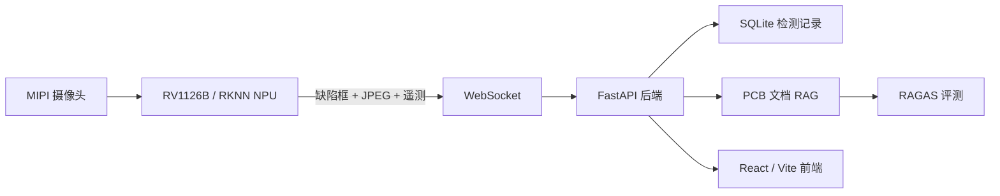

# YOLOv8 PCB 缺陷检测与 RAG 知识问答平台

面向 PCB 生产质检场景，将 YOLOv8 缺陷检测模型部署至 RV1126B 边缘设备，利用板载 NPU 完成六类 PCB 缺陷的实时识别；板端通过 WebSocket 上传检测框、视频帧和运行指标，PC 端负责实时展示、告警存储、质量统计及 PCB 领域 RAG 知识问答。

## 主要功能

- 识别缺孔、鼠咬、开路、短路、毛刺和多余铜箔六类 PCB 缺陷。
- 将 YOLOv8 RKNN 模型部署到 RV1126B NPU，支持摄像头实时推理。
- 通过 WebSocket 传输板端检测框、JPEG 视频帧和遥测指标。
- 支持 PCB 图片上传检测、置信度与 IoU 阈值调整、结果保存。
- 使用 SQLite 保存检测批次和缺陷告警，统计良品率与缺陷分布。
- 支持 TXT/PDF 文档入库、混合检索、查询改写、精排和来源回传。
- 提供基于 RAGAS 的离线检索、回答质量和裁判稳定性评测流程。

## 系统架构



## 技术栈

- 边缘端：RV1126B、RKNPU、RKNN Lite2、OpenCV、FFmpeg、WebSocket
- AI 推理：YOLOv8、Ultralytics、RKNN、ONNX
- 后端：Python 3.11、FastAPI、Uvicorn、SQLite
- RAG：scikit-learn、jieba、Chroma/PostgreSQL（可选）、RAGAS
- 前端：React 19、TypeScript、Vite、Tailwind CSS

## 目录结构

```text
backend/          FastAPI 接口、检测管线、存储与 RAG
web2/             React/Vite 可视化前端
scripts/          RV1126B 板端推理与 WebSocket 推流脚本
model/            YOLO PT/ONNX 模型文件
rag_eveal/        PCB RAG 数据集、适配器与 RAGAS 评测脚本
start.py          PC 端前后端一键启动入口
板端部署.md       RV1126B RKNN 部署与排障说明
```

## PC 端运行

### 1. 安装 Python 依赖

```powershell
python -m venv .venv
.\.venv\Scripts\Activate.ps1
pip install -r requirements.txt
```

### 2. 安装前端依赖

```powershell
cd web2
npm install
cd ..
```

### 3. 启动系统

```powershell
python start.py
```

- 前端：http://localhost:5173
- 后端：http://localhost:5000
- WebSocket：ws://localhost:5000/ws

## RV1126B 板端部署

当前推荐方案使用 `yolov8_best.rknn` 与官方 `rknn_yolov8_cam` 完成 NPU 推理，再由 `scripts/fb_ws_stream.py` 解析检测结果、抓取带框画面并上传到 PC 后端。

```bash
./rknn_yolov8_cam model/yolov8_best.rknn 31
python3 fb_ws_stream.py --host <PC_IP> --port 5000 --fps 5
```

具体环境版本、模型输出解析、摄像头独占和量化问题请参考 [板端部署.md](板端部署.md)。

## RAG 配置

复制示例环境文件并填写自己的模型服务配置。真实 API Key 不应提交到 Git：

```powershell
Copy-Item backend\agent\.env.example backend\agent\.env
```

如果只验证本地稀疏检索，可以保持向量检索与外部 LLM 关闭。RAGAS 评测入口和数据契约见 [rag_eveal/RAGAS_EVALUATION_PROGRESS.md](rag_eveal/RAGAS_EVALUATION_PROGRESS.md)。

## 数据与安全说明

- `.env`、SQLite 数据库、Chroma 索引、缓存和评测结果已由 `.gitignore` 排除。
- 仓库包含模型文件；如需重新训练或量化，请使用自己的数据集和许可合规的权重。
- NASA 原始评测 PDF 不随仓库提交，仅保留数据集、审计信息和来源说明。

## 项目状态

该项目适合本地演示、课程设计和边缘 AI/RAG 工程实践。生产部署前仍需补充身份认证、权限控制、HTTPS、任务队列、结构化监控和完整的性能测试。
